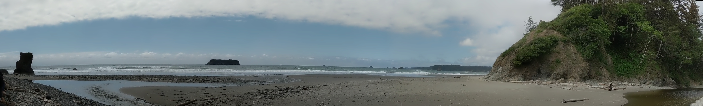

# Panorama

## Examples

  




## Usage

For images:

```
python panorama.py --images PATH/TO/IMAGES --outdir PATH/TO/OUTPUT/FOLDER
```

For video:

```
python panorama_video.py --video PATH/TO/VIDEO --output PATH/TO/OUTPUT/FOLDER
```