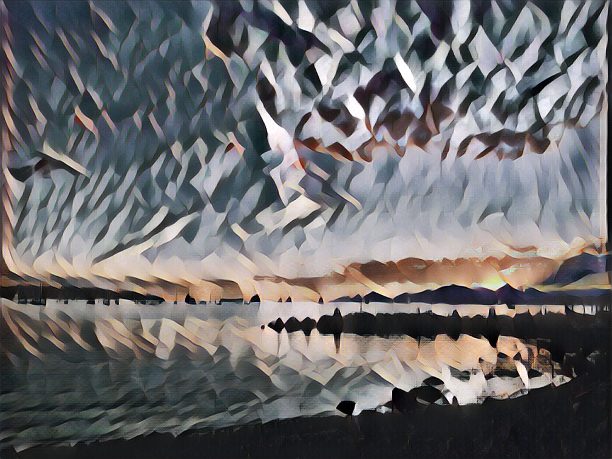

# Style-transfer

## Examples




## Usage

For images:
```
python style_transfer.py --image PATH/TO/IMAGE --style STYLE --outdir PATH/TO/OUTPUT/FOLDER
```

For videos:
```
python style_tranfer_video.py --video PATH/TO/VIDEO --style STYLE --outdir PATH/TO/OUTPUT/FOLDER
```

where `STYLE` can have one of the following values:
- [udnie](https://www.google.com/url?sa=i&source=images&cd=&cad=rja&uact=8&ved=2ahUKEwih1uX1sMbgAhXWGDQIHW_CBaIQjRx6BAgBEAU&url=https%3A%2F%2Fen.wikipedia.org%2Fwiki%2FFile%3AFrancis_Picabia%2C_1913%2C_Udnie_(Young_American_Girl%2C_The_Dance)%2C_oil_on_canvas%2C_290_x_300_cm%2C_Mus%25C3%25A9e_National_d%25E2%2580%2599Art_Moderne%2C_Centre_Georges_Pompidou%2C_Paris..jpg&psig=AOvVaw2SO_0QZKYmgnOu_ISus3T4&ust=1550617083551915)
- [wreck](https://images.fineartamerica.com/images-medium-large-5/the-wreck-of-the-amsterdam-flemish-school.jpg)
- [wave](https://upload.wikimedia.org/wikipedia/commons/a/a5/Tsunami_by_hokusai_19th_century.jpg)
- [scream](https://www.1st-art-gallery.com/frame-preview/16889591.jpg?sku=Unframed&thumb=0&huge=0)
- [rain-princess](https://afremov.com/images/product/RAIN-PRINCESS.jpg)
- [la-muse](https://www.google.com/url?sa=i&source=images&cd=&cad=rja&uact=8&ved=2ahUKEwiv2ba0scbgAhWZFzQIHeD4DuoQjRx6BAgBEAU&url=https%3A%2F%2Fwww.flickr.com%2Fphotos%2Fpeter_withers%2F24516172651&psig=AOvVaw1ysK2ZsSwt_FMVP6hKWxU5&ust=1550617214323763)
